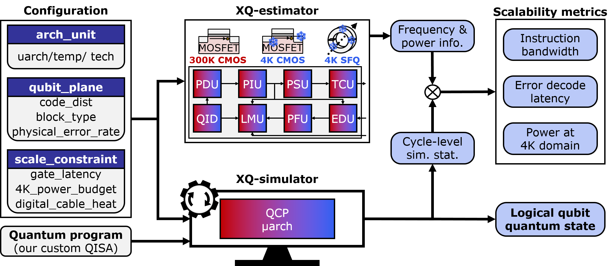
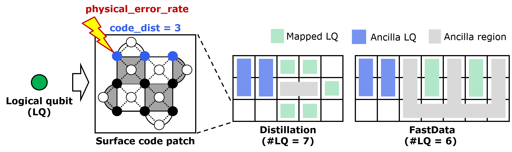
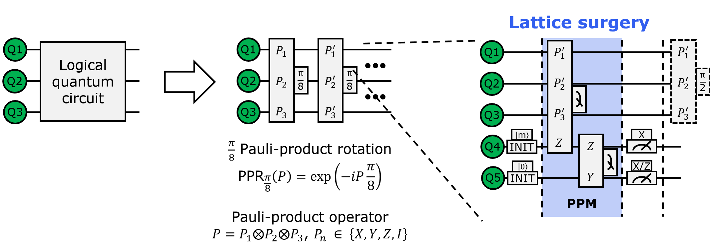
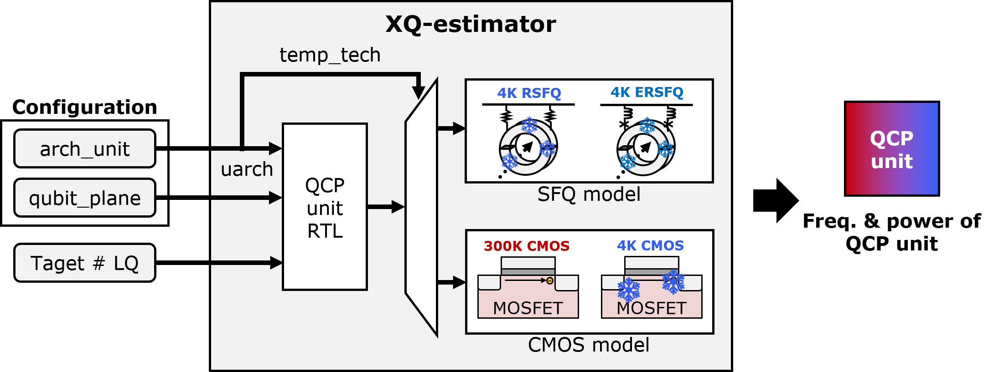
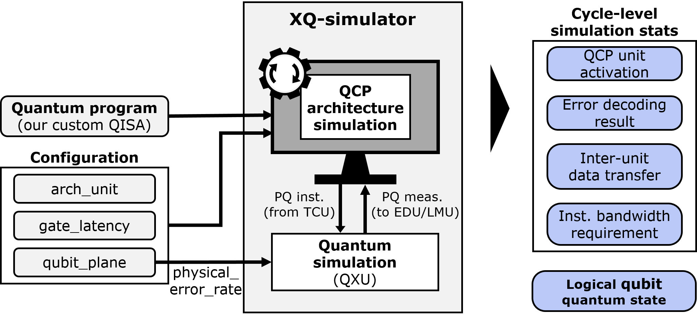

# XQsim: *Cross(X)*-technology *Q*uantum control processor *SIM*ulator 

XQsim is a cross-technology simulation framework for quantum control processors supporting fault-tolerant quantum computing (FTQC). 
The noticeable feature of XQsim is the capability to support various target temperatures, technologies, and microarchitectures. 
XQsim is developed by **[HPCS Lab](https://hpcs.snu.ac.kr)** in Seoul National University (*SNU*).

#### Publication
Please see our recent ISCA 2022 paper for full details. 
If you use XQsim or any of its components in your research, please cite: 

* I. Byun, J. Kim, D. Min, I. Nagaoka, K. Fukumitsu, I. Ishikawa, T. Tanimoto, M. Tanaka, K. Inoue, J. Kim, "XQsim: Modeling Cross-Technology Control Processors for 10+K Qubit Quantum Computers." in *Proceedings of the 49th International Symposium on Computer Architecture (ISCA’22).*
* Bibtex
    ```
    @inproceedings{byun2022xqsim,
        title={XQsim: modeling cross-technology control processors for 10+ K qubit quantum computers},
        author={Byun, Ilkwon and Kim, Junpyo and Min, Dongmoon and Nagaoka, Ikki and Fukumitsu, Kosuke and Ishikawa, Iori and Tanimoto, Teruo and Tanaka, Masamitsu and Inoue, Koji and Kim, Jangwoo},
        booktitle={Proceedings of the 49th Annual International Symposium on Computer Architecture},
        pages={366--382},
        year={2022}
    }
    ```

#### Pre-requirement 
* Python
    * Version - 3.9 
    * Packages - Listed in ```./requirements.txt```
* Open-source tool 
    * [Yosys](https://github.com/YosysHQ/yosys)
* Commercial tool
    * [Design Compiler Ultra](https://www.synopsys.com/implementation-and-signoff/rtl-synthesis-test/dc-ultra.html)


#### Installation

We recommend preparing a virtual conda environment with python version 3.9. 

```
conda create -n xqsim_env python==3.9
conda activate xqsim_env
```

Then, please clone our XQsim repository and install the required python pacakges with the following commands.

```
git clone https://github.com/SNU-HPCS/XQsim
cd XQsim && pip install -r requirements.txt
```

For the open-source and commercial tools, please install them individually. 
Note that the Design Compiler is only required to synthesize new CMOS hardware components.


## Contents
* [1. XQsim overveiw](#1-XQsim-overview)
* [2. QCP microarchitecture](#2-QCP-microarchitecture)
* [3. Configuration](#3-Configuration)
* [4. Quantum compiler](#4-Quantum-compiler)
* [5. XQ-estimator](#5-XQ-estimator)
* [6. XQ-simulator](#6-XQ-simulator)
* [7. XQsim](#7-XQsim)
* [8. Case study](#8-Case-study)
* [9. Contributors](#9-Contributors)
* [10. References](#10-References)


## 1. XQsim overview



We first briefly introduce XQsim with its (1) input, (2) simulation engine, and (3) output. 

### Input
* **Configuration**
    * Configuration file defines the target quantum control system with three fields relevant to QCP architecture, qubit plane, and scalability constraints.

* **Quantum program**
    * Quantum program is the target binary for simulation. Note that this binary should follow our custom logical-qubit level ISA. 

### Simulation engine
* **XQ-estimator**
    * XQ-estimator derives each QCP unit's frequency and power information following the input configuration. For this purpose, XQ-estimator requires each QCP unit's RTL (Verilog) design of the target microarchitecture.
    
* **XQ-simulator**
    * XQ-simulator runs architecture simulation for the target QCP and collects various cycle-level simulation stats. In addition, XQ-simulator runs a physical-qubit level quantum simulation to ensure that the target QCP correctly performs all the essential operations for FTQC.

### Output
* **Scalability metrics**
    * XQsim aggregates the outputs of XQ-estimator and XQ-simulator and derives three types of scalability metrics: (1) instruction bandwidth, (2) error decoding latency, and (3) power consumption at 4K domain. Then, XQsim analyzes the target processor's scalability by comparing the derived metrics and the corresponding constraints.

* **Logical-qubit level quantum state**
    * From the physical-qubit level quantum and architecture simulation, XQ-simulator derives error-corrected logical-qubit level quantum state distribution. With this result, users can check the functional correctness of the simulated QCP.


## 2. QCP microarchitecture


XQsim is developed with our full quantum control processor (QCP) microarchitecture, which can run an arbitrary quantum program in the FTQC regime.


### Microarchitecture components
Our QCP microarchitecture consists of nine hardware units (i.e., QCP unit).

* **Quantum instruction memory (QIM)**: QIM provides logical-qubit level instructions to QID. Note that these instructions follow our custom ISA format.

* **Quantum instruction decoder (QID)**: QID decodes input logical-qubit level instructions and forwards them to PDU. Meanwhile, QID forwards logical-qubit measurement instructions to LMU.

* **Patch decode unit (PDU)**: PDU translates logical-qubit level target lists into patch-level target lists. PDU forwards the identified target patch lists to PIU.

* **Patch information unit (PIU)**: PIU updates the target patches' state/boundary information or forwards the information to other units (PSU, EDU, PFU, LMU). PIU is the key to identifying dynamically changing target physical qubits during lattice surgery.

* **Physical schedule unit (PSU)**: PSU generates physical-qubit level instructions (codewords) corresponding to the logical-qubit level instruction. More importantly, PSU schedules the codewords only to the target physical qubit location based on the given patch information. 

* **Time control unit (TCU)**: TCU takes the scheduled codewords from PSU and sends them to the quantum-classical interface (QCI) at the accurate timing.
	
* **Error decode unit (EDU)**: EDU runs an error decoding algorithm by taking error syndromes generated from QCI. As a result, EDU identifies the types and locations of errors and forwards them to PFU.

* **Pauliframe unit (PFU)**: PFU keeps tracking the identified errors from EDU. PFU forwards the accumulated errors to LMU for virtual error correction.

* **Logical measure unit (LMU)**: LMU performs all the complex operations related to the logical-qubit measurement, including virtual error correlation, byproduct operator tracking, logical-qubit sign tracking, and physical-to-logical measurement interpretation.

### Note for the current version
* QCP architecture performs FTQC with the surface code, especially patch-based lattice surgery [\[1\]](#ref-gsc).
* EDU currently adopts the heuristic decoding algorithm proposed in QECOOL [\[2\]](#ref-qecool).


## 3. Configuration 
XQsim requires a configuration file, which mainly consists of three fields: (1) arch_unit, (2) qubit_plane, and (3) scale_constraint. 

### arch_unit


The arch_unit field defines each QCP unit's microarchitecture (uarch), operating temperature (temp), and device technology (tech) configurations. The table above summarizes the arch_unit configuration support of the current XQsim version. 

### qubit_plane



The qubit_plane field defines parameters related to the qubit plane: surface code distance (code_dist), physical qubit error rate (physical_error_rate), and block type (block_type).

* **code_dist**
	* Number of physical qubits on the edge of surface code patch representing a logical qubit. 
	* Support: Odd integer

* **physical_error_rate**
	* Probability to inject Pauli error for each physical-qubit level operation. 
	* Support: Float in [0, 1]

* **block_type**
	* Way to map the logical qubit to the array of physical qubit patches. 
	* Support: "Distillation" or "FastData" [\[1\]](#ref-gsc) 


### scale_constraint

The scale_constraint field defines parameters relevant to the scalability constraitns: quantum gate latency (gate_latency), cooling power budget at 4K (4K_power_budget), and digital cable heat dissipation coefficient (digital_cable_heat). 

* **gate_latency**
	* Latency of single-qubit gate (sqgate_ns), two-qubit gate (tqgate_ns), and measurement (meas_ns). 
	* Support: Integer [ns]

* **4K_power_budget**
	* Cooling power budget of 4K domain
	* Support: Integer [mW]

* **digital_cable_heat**
	* Digital cable's heat dissipation coefficient per bit-transfer speed.
	* Support: Float [mW/Gbps]
		
We provide an example scale_constraint configuration below.

```
    "scale_constraint":{
        "gate_latency":{ 
            "sqgate_ns": 14,  		/* ns */ 		[\[3\]](#ref-gl)
            "tqgate_ns": 26,  		/* ns */ 		[\[3\]](#ref-gl)
            "meas_ns": 600     		/* ns */ 		[\[3\]](#ref-gl)
        },  
        "4K_power_budget": 1500, 	/* mW */ 		[\[4\]](#ref-4kp)
        "digital_cable_heat": 3.1 	/* mW/Gbps */ 	[\[5\]](#ref-dcp)
    } 
```


### Directory structure
    .
    ├── src  
    ├    └── configs	# XQsim finds configration file from this directory


### Note for the current version
* **arch_unit**
	* QIM does not support any specific microarchitecture and device technology. QIM is assumed to operate at 300K. 
	* QXU indicates the quantum execution unit, which models QCI and qubit chip. The current XQsim version assumes the QCI and the qubit chip locate at 4K and 20mK, respectively (inside the fridge).

* **qubit_plane**
	* The current version supports "Distillation" block_type only. "FastData" block_type will be updated in the next version.


## 4. Quantum compiler



For the functionally correct FTQC simulation, XQsim requires a quantum binary generated by our quantum compiler and custom ISA. First, the quantum compiler translates a logical quantum circuit into the sequence of Pauli-product rotations (PPR) and Pauli-product measurements (PPM) by following the decomposition rules in the above figure [\[1\]](#ref-gsc). Next, the compiler translates the sequence of PPR and PPM with our custom ISA. 
Please check the 64-bit logical-qubit level ISA definition in ```./src/isa_format.json```. 

### Usage
#### Command:
```
python ./src/compiler/gsc_compiler.py -qc {quantum_circuit} -m {compile_mode}
```

#### Options:
* quantum_circuit
    * Target quantum circuit's name used to find target file from ./src/quantum_circuits/ directory
* compile_mode
    * List of target compilation modes (steps) among ["transpile", "qisa_compile", "assemble"]

#### Output:
* compiled quantum circuit for {compile_mode}
	* transpile 	- ./src/quanum_circuits/transpiled/{quantum_circuit}.qtrp
	* qisa_compile 	- ./src/quanum_circuits/qisa_compiled/{quantum_circuit}.qisa
	* assemble 	- ./src/quantum_circuits/binray/{quantum_circuit}.qbin

#### Example: 
```
python ./src/compiler/gsc_compiler.py -qc qft_n2 -m transpile,qisa_compile,assemble
```

### Directory structure
    .
    ├── src  
    ├    └── isa_format.json             # Custom ISA definition file	
    ├    └── compiler	
    ├    ├       └── gsc_compiler.py     # Quantum compiler source file
    ├    ├       └── gridsynth           # Grid synthesizer translating an arbitrary single-qubit gate into the Clifford+T gates [6]
    ├    └── quantum_circuits				 
    ├    ├       └── open_qasm           # Logical quantum circuits written in OpenQASM (*.qasm)
    ├    ├       └── transpiled          # Transpiled sequence of PPR & PPM (*.qtrp)
    ├    ├       └── qisa_compiled       # Compiled program with our custom isntructions (*.qisa)
    ├    ├       └── binary              # Binary generated following the custom ISA definition (*.qbin)

### Note for the current version
* A quantum binary requires the FastData block type if it includes a PPM with X or Y operator.


## 5. XQ-estimator



XQ-estimator derives each QCP unit's frequency and power by following the input configuration (i.e., arch_unit, qubit_plane) and target qubit scale (i.e. number of logical qubits).
For this purpose, XQ-estimator requires RTL designs (i.e., Verilog) for the target QCP units to run its CMOS and SFQ models. 


### RTL implementation of the full QCP microarchitecture
XQsim repository provides RTL source files of all QCP units, which can run an arbitrary quantum algorithm based on the surface-code lattice surgery [\[1\]](#ref-gsc). 
More importantly, all RTL designs are well-parameterized to explore various microarchitectural configurations (e.g., target qubit scale). 
Please find our RTL implementation from the ```./src/XQ-estimator/{QCP_unit}/{uarch}/rtl/``` directories.


### CMOS model
The CMOS model of XQ-estimator utilizes [CryoModel](https://github.com/SNU-HPCS/CryoModel), which includes a cryogenic CMOS processor model (Cryo-Pipeline).
XQ-estimator uses the target QCP unit's RTL as the CryoModel's input and derives the frequency and power for the 300K CMOS or 4K CMOS technology.
Our CMOS model supports the voltage optimization option for the 4K CMOS technology (i.e., 4K_CMOS_Vopt).


### SFQ model
The XQ-estimator's SFQ model derives the target SFQ-based QCP unit's frequency and power. 
First, it generates the SFQ gate netlists by running SFQ-specific synthesis, which applies splitter insertion, path balancing, clock tree generation, and timing optimization. 
Next, based on the input RSFQ gate library information (e.g., timing, power), our SFQ model estimates the frequency and power for the 4K RSFQ or 4K ERSFQ technology.

### Usage
#### Command:
```
python ./src/XQ-estimator/xq_estimator.py -c {config} -q {num_lq} -ds {dump_synth} -rs {regen_synth} -de {dump_est} -re {regen_est}
```

#### Options:
* config
	* Target configuration's name used to find target file from ./src/configs/ directory
* num_lq
	* Target number of logical qubits (including ancilla logical qubits)
* dump_synth
	* Flag indicating whether to store (dump) CMOS/SFQ synthesis results or not
* regen_synth
	* Flag indicating whether to re-run CMOS/SFQ synthesis or not
* dump_est
	* Flag indicating whether to store (dump) frequency and power estimation results or not
* regen_est
	* Flag indicating whether to re-generate frequency and power estimation results or not


#### Output:
* Frequency & Power consumption of all QCP units (for the given configuration and qubit scale)


#### Example:
```
python ./src/XQ-estimator/xq_estimator.py -c example_cmos_d5 -q 5 -ds False -rs False -de False -re False
```


### Directory structure
    .   
    ├── src  
    ├    └── XQ-estimator   
    ├    ├      └── xq_estimator.py                 # XQ-estimator source file
    ├    ├      └── CryoModel                       # CryoModel (downloaded)
    ├    ├      └── rsfq_common                     # Common files for SFQ modeling
    ├    ├      ├       └── rtl                     # Common RTL files
    ├    ├      ├       └── mitll_v2p1.*            # RSFQ gate library information [7]
    ├    ├      ├       └── insert_sfq_gate.py      # SFQ synthesis - Splitter insertion & Path balancing
    ├    ├      ├       └── adjust_sfq_timing.py    # SFQ synthesis - Clock tree generation & Timing optimization (+ Wiring)
    ├    ├      └── {QCP_unit}                      # Directory for each QCP unit 
    ├    ├      ├       └── {uarch}                 # Directory for each supported microarchitecture
    ├    ├      ├       ├       └── rtl             # RTL source files
    ├    ├      ├       ├       └── cmos            # Dumped CMOS model results
    ├    ├      ├       ├       └── rsfq            # Dumped SFQ model results (and microunit_template.json)


### Note for the current version
* **RTL implementation**
	* RTL designs are validated with XQ-simulator, which correctly supports the complete FTQC process.
	* SFQ-specific microarchitectures (i.e., PSU-maskshare, TCU-simplebuf, EDU-fastsliding) do not include the RTL implementation but share RTL designs of their baselines (or fast).

* **CMOS model**
	* Our repository includes the CMOS model's results for our current arch_unit configuration coverage (users can get these results with the options: regen_synth = False, regen_result = False). 
	* The current version supports the 45nm technology node (with FreePDK library [\[8\]](#ref-pdk)).
	* V<sub>dd</sub> and V<sub>th</sub> for the 4K_CMOS_Vopt are manually defined with the fixed values.
* **SFQ model**
	* The current version runs the SFQ-specific synthesis for small pieces of hardware components and aggregates their results for the final estimation. For this purpose, each QCP unit microarchitecture requires the corresponding munit_template.json file. 
	* ColdFlux logic cell library for MIT-LL SFQ process [(version 2.1)](https://github.com/sunmagnetics/RSFQlib/tree/master/Old%20Versions/v2p1) is used for the current version.


## 6. XQ-simulator 



XQ-simulator runs two types of simulation: QCP architecture simulation and physical-qubit level quantum simulation. As a result, XQ-simulator derives the cycle-level simulation stats and logical-qubit level quantum state distribution.


### QCP architecture simulation

XQ-simulator's role is to obtain cycle-level simulation stats required for deriving the target QCP's scalability. For this purpose, XQ-simulator takes a quantum program (binary) and configuration as its input and runs a QCP architecture simulation. As a result, XQ-simulator reports the activated cycles for each QCP unit, error decoding results, inter-unit data transfer, and instruction bandwidth requirement.


### Physical-qubit level quantum simulation
The other goal of the XQ-simulator is to ensure that the target QCP architecture performs the entire FTQC process correctly. To achieve this goal, the quantum execution unit (QXU) runs a physical-qubit level quantum simulation to track the quantum state. Specifically, when TCU outputs the physical-qubit level instructions, QXU takes them and runs a noisy quantum simulation. In addition, if QXU receives the measurement instruction, it measures physical qubits and forwards the measurements to the simulation modules corresponding to EDU and LMU. Eventually, XQ-simulator reports the logical-qubit level quantum state derived from the physical-qubit level quantum simulation (QXU), quantum error correction (EDU & PFU), and logical measurement interpretation (LMU).


### Usage
#### Command:
```
python ./src/XQ-simulator/xq_simulator.py -c {config} -b {qbin} -s {num_shots} -di {dump_sim} -ri {regen_sim} -sp {skip_pqsim} -db {debug}
```

#### Options:
* config
	* Target configuration's name used to find target file from ./src/configs/ directory
* qbin 
	* Target quantum binary's name used to find target file from ./src/quantum_circuits/binary/ directory
* num_shots
	* Number of samplibg shots to extract the logical-qubit level quantum state distribution
* dump_sim
	* Flag indicating whether to store (dump) simluation results or not
* regen_sim
	* Flag indicating whether to re-generate simluation results or not
* skip_pqsim
    * Flag indicating whether to skip the physical-qubit level simulation or not
* debug
    * Flag indicating whether to print debugging messages or not

#### Output:
* Cycle-level simulation stats
	* Number of activation for each QCP unit
	* Error decoding results (e.g., number of token setup, number of error match, error-pariring cycles)
	* Amount of transferred data (bits) between all QCP units
	* Instruction bandwidth requirement (bits per cycles)

* Logical-qubit level quantum state distribution 
	* Logical-qubit state derived from the physical-qubit level quantum simulation and FTQC archtiecture simulation. 


#### Example:
```
python ./src/XQ-simulator/xq_simulator.py -c example_cmos_d5 -b pprIIZZZ_n5 -s 2048 -di True -ri True -sp False -db False
```

### Directory structure
    .
    ├── src
    ├    └── XQ-simulator
    ├    ├      └── xq_simulator.py                 # XQ-simulator source file
    ├    ├      └── quantum_instruction_fetch.py    # Architecture simulation module: QIM
    ├    ├      └── quantum_instruction_decoder.py  # Architecture simulation module: QID
    ├    ├      └── patch_decode_unit.py            # Architecture simulation module: PDU
    ├    ├      └── patch_information_unit.py       # Architecture simulation module: PIU
    ├    ├      └── physical_schedule_unit.py       # Architecture simulation module: PSU
    ├    ├      └── time_controL_unit.py            # Architecture simulation module: TCU
    ├    ├      └── error_decode_unit.py            # Architecture simulation module: EDU
    ├    ├      └── pauliframe_unit.py              # Architecture simulation module: PFU
    ├    ├      └── logical_measure_unit.py         # Architecture simulation module: LMU
    ├    ├      └── qtexec_unit.py                  # Quantum simulation module (QXU)
    ├    ├      └── simres                          # Dumped simulation results
    ├    ├      ├       └── {config}				# Simulated configuration
    ├    ├      ├       ├       └── {qbin}.stat     # Simulation result: Cycle-level stats
    ├    ├      ├       ├       └── {qbin}.pqsim    # Simulation result: Logical quantum state distribution


### Note for the current version
* **QCP architecture simulation**
	* QCP unit modules accurately model the hardware-level operations to validate the corresponding RTL designs. If we increase their abstraction level, the QCP architecture simulation can be much faster than the current version.
	* The current architecture simulation assumes 1GHz operation (1 cycle per 1ns). 

* **Physical-qubit level quantum simulation**
	* For the noisy quantum simulation, QXU adopts the Pauli quantum error model [\[9\]](#ref-perr). Specifically, QXU injects Pauli error gates for every physical quantum gate by following the physical_error_rate (input configuration). 
	* QXU utilizes a fast stabilizer circuit simulator supporting Clifford gates, Stim [\[10\]](#ref-stim). Stim has no limitation in the simulation qubit scale but slows down with the time complexity of O(n<sup>2</sup>) [\[10\]](#ref-stim).
	* To support T gate, QXU adopts the methodology introduced in [\[11\]](#ref-tg) (low-rank stabilizer decompositions of magic states). As each PPR<sub>$\frac{\pi}{8}$</sub> includes a T gate, the current version's quantum simulation exponentially slows down with the increasing number of PPR<sub>$\frac{\pi}{8}$</sub>.


## 7. XQsim 

XQsim derives the scalability metrics by integrating the results of XQ-estimator and XQ-simulator. In addition, it analyzes the target QCP architecture by comparing the scalability metrics to the corresponding scalability constraints.

### Usage 
#### Command:
```
python ./src/xqsim.py -c {config} -b {qbin} -s {num_shots} -ds {dump_synth} -rs {regen_synth} -de {dump_est} -re {regen_est} -di {dump_sim} -ri {regen_sim} -sp {skip_pqsim} -db {debug}
```

#### Options:
Same as the options of XQ-estimator and XQ-simulator

#### Output:
* Scalability metrics vs. Scalability constraints
	* Instruction bandwidth vs. Instruction bandwidth requirement (Max. & Avg.)
	* Error decoding latency (Max. & Avg) vs. Error syndrome measurement (ESM) latency
	* Power dissipation at 4K (Device + Digital cable, Max. & Avg.) vs. Power budget at 4K

* Logical-qubit level quantum state distribution 
	* Output of XQ-simulator

#### Example:
```
python ./src/xqsim.py -c example_cmos_d5 -b pprIIZZZ -s 2048 -ds False -rs False -de False -re False -di False -ri False -sp True -db False
```

### Note for the current version
* **Single ESM simulation**
	* If a user tries to analyze the target QCP's scalability, we recommend running a single ESM merging all logical qubits rather than a complex quantum program. This simulation will report results sufficient for the conservative scalability analysis.
	* Our repository includes a script to generate a quantum binary corresponding to the single ESM. Please run ```python ./src/gen_single_esm.py -q {num_lq}``` and use ```esm_n{num_lq-2}``` as input {qbin} argument.
	* In this scenario, we recommend turning on the ```skip_pqsim``` option, which skips the physical-qubit level simulation but reports accurate cycle-level simulation stats.


## 8. Case study

This repository also includes a jupyter notebook that introduces example case studies with four configurations: (1) current_300K_CMOS, (2) nearfuture_4K_CMOS, (3) nearfuture_4K_RSFQ, and (4) future_4K_ERSFQ. Please refer to the ```./CaseStudy.ipynb```.


## 9. Contributors
* [Ilkwon Byun](https://hpcs.snu.ac.kr/~ilkwon/)
* [Junpyo Kim](https://hpcs.snu.ac.kr/~junpyo/)
* [Dongmoon Min](https://hpcs.snu.ac.kr/~dongmoon/)
* [Jangwoo Kim](https://hpcs.snu.ac.kr/~jangwoo/)


## 10. Refrences
* <a id="ref-gsc"/>[1] Litinski, Daniel. "A game of surface codes: Large-scale quantum computing with lattice surgery." Quantum 3 (2019): 128.
* <a id="ref-qecool"/>[2] Ueno, Yosuke, et al. "Qecool: On-line quantum error correction with a superconducting decoder for surface code." 2021 58th ACM/IEEE Design Automation Conference (DAC). IEEE, 2021.
* <a id="ref-gl"/>[3] Google Quantum AI. "Exponential suppression of bit or phase errors with cyclic error correction." Nature 595, 383–387 (2021).
* <a id="ref-4kp"/>[4] Krinner, Sebastian, et al. "Engineering cryogenic setups for 100-qubit scale superconducting circuit systems." EPJ Quantum Technology 6.1 (2019): 2.
* <a id="ref-dcp"/>[5] Hashimoto, Yoshihito, et al. "Implementation and experimental evaluation of a cryocooled system prototype for high-throughput SFQ digital applications." IEEE transactions on applied superconductivity 17.2 (2007): 546-551.
* <a id="ref-gsyn"/>[6] Ross, Neil J., and Peter Selinger. "Optimal ancilla-free Clifford+ T approximation of z-rotations." arXiv preprint arXiv:1403.2975 (2014).
* <a id="ref-mitll"/>[7] Schindler, Lieze, Johannes A. Delport, and Coenrad J. Fourie. "The ColdFlux RSFQ cell library for MIT-LL SFQ5ee fabrication process." IEEE Transactions on Applied Superconductivity 32.2 (2021): 1-7.
* <a id="ref-pdk"/>[8] Stine, James E., et al. "FreePDK: An open-source variation-aware design kit." 2007 IEEE international conference on Microelectronic Systems Education (MSE'07). IEEE, 2007.
* <a id="ref-perr"/>[9] Tomita, Yu, and Krysta M. Svore. "Low-distance surface codes under realistic quantum noise." Physical Review A 90.6 (2014): 062320.
* <a id="ref-stim"/>[10] Gidney, Craig. "Stim: a fast stabilizer circuit simulator." Quantum 5 (2021): 497.
* <a id="ref-tg"/>[11] Bravyi, Sergey, Graeme Smith, and John A. Smolin. "Trading classical and quantum computational resources." Physical Review X 6.2 (2016): 021043.
 
